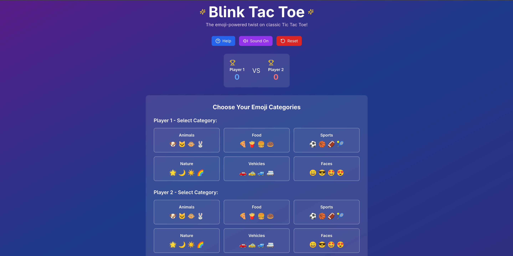
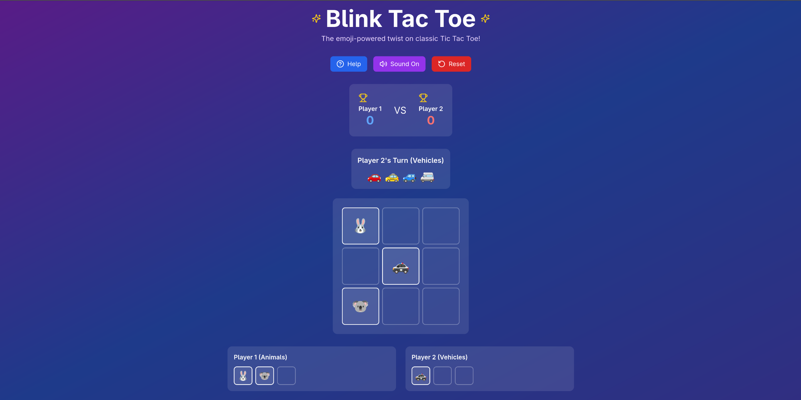
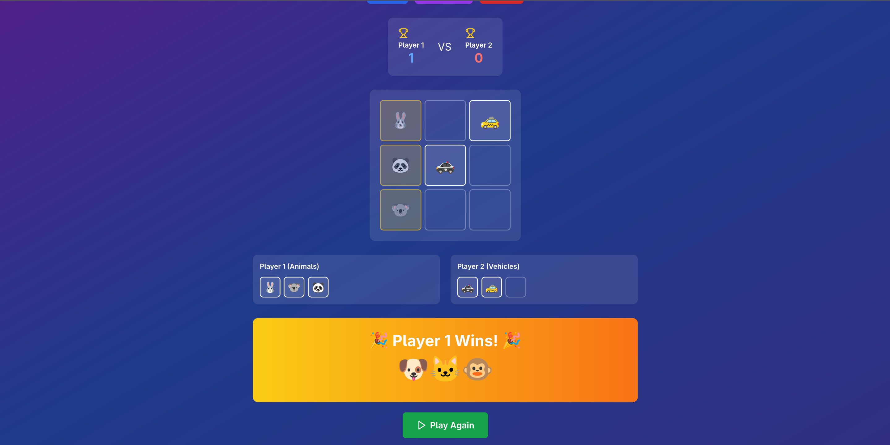

# 🎮 Blink Tac Toe

A modern twist on the classic Tic Tac Toe game with emoji-powered gameplay and vanishing mechanics!

## 🚀 Live Demo

[Play the game here!](https://blink-tac-toe-beta.vercel.app/)

## 📱 Screenshots





## 🛠️ Tech Stack

- **Frontend Framework**: React.js 18+
- **Styling**: Tailwind CSS 3.x
- **Icons**: Lucide React
- **Audio**: Web Audio API (native browser support)
- **State Management**: React Hooks (useState, useEffect, useCallback)
- **Build Tool**: Create React App / Vite
- **Deployment**: Vercel/Netlify (recommended)

## 🎯 Emoji Categories

The game features **6 unique emoji categories** for players to choose from:

1. **Animals**: 🐶 🐱 🐵 🐰 🦊 🐻 🐼 🐨
2. **Food**: 🍕 🍟 🍔 🍩 🍪 🎂 🍦 🍭
3. **Sports**: ⚽ 🏀 🏈 🎾 🏐 🏓 🎱 🏸
4. **Nature**: 🌟 🌙 ☀️ 🌈 ⭐ 💫 🌸 🍀
5. **Vehicles**: 🚗 🚕 🚙 🚐 🚛 🏎️ 🚓 🚑
6. **Faces**: 😀 😎 🤩 😍 🥳 😊 🤗 😂

Each category contains 8 different emojis, and players get a random emoji from their chosen category on each turn.

## ✨ Vanishing Feature Implementation

The "vanishing" mechanic is the core innovation of Blink Tac Toe:

### How It Works
1. **FIFO Queue System**: Each player's emojis are tracked in an array that acts as a First-In-First-Out queue
2. **3-Emoji Limit**: When a player tries to place their 4th emoji, the oldest emoji automatically disappears
3. **Position Blocking**: The 4th emoji cannot be placed where the 1st emoji was originally located
4. **Visual Feedback**: Disappearing emojis have a smooth fade-out animation

### Technical Implementation
```javascript
// Track each player's emojis with position and timestamp
const [playerEmojis, setPlayerEmojis] = useState({ 1: [], 2: [] });

// When placing a new emoji
if (newPlayerEmojis[currentPlayer].length > 3) {
  const oldestEmoji = newPlayerEmojis[currentPlayer].shift(); // Remove oldest
  newBoard[oldestEmoji.position] = null; // Clear from board
  // Add disappearing animation
  setAnimatingCells(prev => new Set(prev).add(oldestEmoji.position));
}
```

### Key Features
- **Smooth Animations**: CSS transitions for placement and removal
- **Position Memory**: Tracks where each emoji was placed to enforce blocking rule
- **Visual Indicators**: Players can see their current 3 emojis in dedicated trackers

## 🎨 Key Features

### Core Gameplay
- ✅ 3x3 grid with emoji-based pieces
- ✅ Turn-based alternating gameplay
- ✅ Random emoji assignment from selected categories
- ✅ FIFO vanishing rule (max 3 emojis per player)
- ✅ Standard Tic Tac Toe win conditions

### UI/UX Enhancements
- ✅ Responsive design (mobile & desktop)
- ✅ Category selection before game start
- ✅ Real-time player emoji tracking
- ✅ Smooth animations for all interactions
- ✅ Winning line highlighting with pulse effect
- ✅ Score tracking across multiple rounds

### Bonus Features
- ✅ Sound effects with toggle option
- ✅ Help section with complete rules
- ✅ Glass-morphism design aesthetic
- ✅ Accessibility considerations
- ✅ Reset and play again functionality

## 🚀 Installation & Setup

```bash
# Clone the repository
git clone https://github.com/himanshu01010/Blink-tac-toe.git
cd blink-tac-toe

# Install dependencies
npm install

# Start development server
npm start

# Build for production
npm run build
```

### Dependencies
```json
{
  "react": "^18.2.0",
  "react-dom": "^18.2.0",
  "lucide-react": "^0.263.1",
  "tailwindcss": "^3.3.0"
}
```

## 🎮 How to Play

1. **Setup**: Each player selects a different emoji category
2. **Gameplay**: Players take turns placing random emojis from their category
3. **Vanishing Rule**: When placing a 4th emoji, the oldest one disappears
4. **Winning**: Get 3 of your emojis in a row (horizontal, vertical, or diagonal)
5. **Special Rule**: 4th emoji cannot be placed where 1st emoji was!

## 🔧 What I'd Improve With More Time

### Performance Optimizations
- **Memoization**: Use `React.memo` and `useMemo` for expensive computations
- **Virtual DOM**: Optimize re-renders with better state structure
- **Code Splitting**: Lazy load components for faster initial load

### Enhanced Gameplay
- **AI Player**: Single-player mode with intelligent computer opponent
- **Tournament Mode**: Best-of-X rounds with bracket system
- **Custom Categories**: Allow players to create their own emoji sets
- **Difficulty Levels**: Adjustable vanishing rules (2-5 emoji limits)

### Advanced Features
- **Multiplayer**: Real-time online gameplay with WebSocket
- **Replay System**: Save and replay game sessions
- **Statistics**: Detailed player performance analytics
- **Themes**: Multiple visual themes and color schemes
- **Accessibility**: Better screen reader support and keyboard navigation

### Technical Improvements
- **TypeScript**: Add type safety for better development experience
- **Testing**: Comprehensive unit and integration tests
- **PWA**: Progressive Web App capabilities for offline play
- **Analytics**: Track user engagement and popular categories
- **Internationalization**: Multi-language support

### Mobile Experience
- **Haptic Feedback**: Vibration on emoji placement
- **Gesture Controls**: Swipe gestures for navigation
- **App Store**: Native mobile app versions
- **Push Notifications**: Game invitations and reminders

## 📱 Browser Compatibility

- ✅ Chrome 80+
- ✅ Firefox 75+
- ✅ Safari 13+
- ✅ Edge 80+
- ⚠️ Web Audio API required for sound effects
